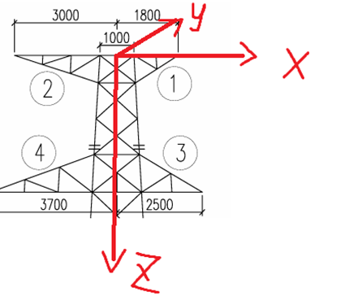
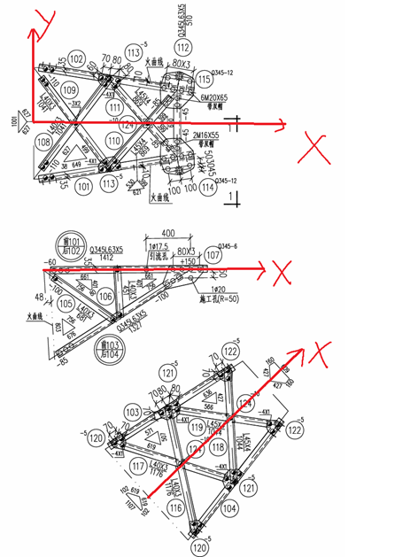
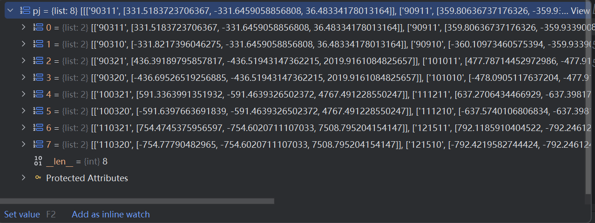

# 担架部分的二维转三维

## 1. 整体输入输出效果

### 1.1 输入
每个担架的三视图的杆件及对应的二维坐标


`杆件ID`: `[左端点(x,y),右端点(x,y)]`

- 正视图：`coordinatesFront_data`
- 底视图：`coordinatesBottom_data`
- 顶视图：`coordinatesOverhead_data`

```
coordinatesFront_data={
106:[(646.0281930611799,342.53768195250086),(660.2590727783954,613.9408879879702)],
105:[(203.7373011800923,347.7106748399989),(620.4367599213521,639.6744403396317)],
103:[(240.64789004321037,885.0975728601636),(1088.2557311595408,337.3654300449176)],
101:[(203.7373011800923,347.7106748399989),(1088.2557311595408,337.3654300449176)],
}
coordinatesBottom_data={
119:[(630.1258693028335,518.7340651761596),(1278.9278879433205,620.6886681053786)],
103:[(310.11096106234515,725.8634556230776),(983.3900198457354,290.0841295496858)],
104:[(784.4021660422503,1254.0464061958883),(1278.9278879433205,620.6886681053786)],
118:[(983.3900198457354,290.0841295496858),(1018.1405904800162,954.6887929303084)],
116:[(626.3346511498411,521.1879280583553),(784.4021660422503,1254.0464061958883)],
117:[(310.11096106234515,725.8634556230776),(1018.6215195146591,954.0728489822498)],
}
coordinatesOverhead_data={
102:[(96.6401359210612,475.9291642161667),(961.9289558665229,611.903121636168)],
108:[(98.2077827818514,1150.819369486731),(552.7310243183496,547.6005895357405)],
110:[(556.2979668323961,1077.868239473998),(961.9289558665229,611.903121636168)],
101:[(98.2077827818514,1150.819369486731),(964.1463078156362,1012.9181523853322)],
109:[(96.6401359210612,475.9291642161667),(551.1408795062896,1078.6895086500524)],
111:[(560.3147685231477,548.7923207679231),(964.1463078156362,1012.9181523853322)],
112:[(961.9289558665229,611.903121636168),(964.1463078156362,1012.9181523853322)],
}
```

### 1.2 输出

输出分两部分：
- **节点**的三维信息：`(节点编号：X坐标，Y坐标，Z坐标，对称性)`
- **杆件**的三维信息：`(杆件编号：起点节点，终点节点，对称性)`


#### 1.2.1 对称性

**节点和杆件的对称性**
- 0：代表没有对称性，就这一个**单独的节点/杆件**
- 1：左右对称（对称性1）
- 2：前后对称（对称性2）
- 3：关于Z轴对称（对称性3）
- 4：以及四角对称（对称性4）

#### 1.2.2 XYZ坐标的表示

- **一类节点**（一类杆件的两个端点）：真实的`(x,y,z)`三维坐标表示
- **二类节点**（非一类节点）：`x`坐标用**真实值**；`(y,z)`分别用一类杆件的两个端点节点编号表示(引用表示法)

#### 1.2.3 XYZ坐标轴的方向

- `X轴`：从左往右
- `Y轴`：从前往后
- `Z轴`：从上到下





----
----


## 2. get_first_ganjian_id.py

获取每个视图的两个一类杆件的ID：（杆件长度+杆件ID编号）判断

1. 选**长度**最长的 `top_k` 根作为候选；
2. 再检查候选是否包含编号最小的那根或正好是最小两根；
3. 不满足则回退为**编号最小**的两根，最后按编号升序返回。


## 3. xintrans.py的代码逻辑

### 3.1 输入和输出
#### 输入


| 字段名          | 含义说明            |
| ------------ | --------------- |
| file_path    | 文件的路径           |
| drawing_id   | 担架图纸的序号         |
| data1        | 担架和塔身**连接点**的**真实三维坐标** |
| drawing_type | 图纸类型            |


#### 输出

| 字段名     | 含义说明        |
| ------- | ----------- |
| jiedian | 节点的三维信息 |
| ganjian | 杆件的三维信息     |


### 3.2 预处理

#### 3.2.1 读取二维坐标数据

`coordinatesFront_data`和`coordinatesBottom_data`和`coordinatesOverhead_data`分别代表前视图、底视图、顶视图传来的二维数据

```py
coordinatesFront_data = namespace.get('coordinatesFront_data', {})
coordinatesBottom_data = namespace.get('coordinatesBottom_data', {})
coordinatesOverhead_data = namespace.get('coordinatesOverhead_data', {})
```


#### 3.2.2 转换data1连接点的数据存入pj[]中



`pj` 是一个 **四维数组（嵌套列表）**，结构如下：

```
pj[担架图纸ID][担架上下端点(0/1)][节点编号ID][三维坐标XYZ真实值]
```


| 表达式                       | 含义                        |
| ------------------------- | ------------------------- |
| `pj[drawing_id][0][0]`    | 第 drawing_id 号担架**上连接点**的节点编号 |
| `pj[drawing_id][1][0]`    | 第 drawing_id 号担架**下连接点**的节点编号 |
| `pj[drawing_id][0][1]`    | 第 drawing_id 号担架**上连接点**的三维坐标(x,y,z) |
| `pj[drawing_id][1][1]`    | 第 drawing_id 号担架**下连接点**的三维坐标(x,y,z) |
| `pj[drawing_id][0][1][0]` | 第 drawing_id 号担架**上连接点**的 x 坐标                |
| `pj[drawing_id][0][1][1]` | 第 drawing_id 号担架**上连接点**的 y 坐标                |
| `pj[drawing_id][0][1][2]` | 第 drawing_id 号担架**上连接点**的 z 坐标                |
| `pj[drawing_id][1][1][0]` | 第 drawing_id 号担架**下连接点**的 x 坐标                |
| `pj[drawing_id][1][1][1]` | 第 drawing_id 号担架**下连接点**的 y 坐标                |
| `pj[drawing_id][1][1][2]` | 第 drawing_id 号担架**下连接点**的 z 坐标                |


### 3.3 if-else逻辑


1. `if(drawing_id * 100 + 1 in coordinatesBottom_data)`: 处理下面（**非最上层**）的担架（3，4，5，6，7，8）
2. `else`: 处理**最上层**的担架（1，2）


## 4. 每一个担架的处理逻辑
1. 尖点的生成：完成一类节点的生成
2. 

### 4.1 尖点的生成（一类节点的生成）

基于`calc_jiandian_xyz()`函数生成尖点的三维坐标信息

**尖点**（一类节点）：**一类杆件的一端节点**（非担架塔身连接点），是一类节点，用**真实的三维坐标**表示（x,y,z）


| 担架ID | 尖点ID |
| ---------- | ----------- |
| 1          | 10120       |
| 2          | 20120       |
| 3          | 30120       |
| 4          | 40120       |
| 5          | 50120       |
| 6          | 60120       |
| 7          | 70120       |
| 8          | 80120       |


### 4.2 正视图/底视图/顶视图

**输出**：生成正视图/底视图/顶视图中的**二类节点**及其**二类杆件**的三维信息


#### 4.2.1 找到一类杆件上的交点及其对应的三维x值


1. 获得两个一类杆件上的交点坐标（二维）：(x,y)
2. 得到交点坐标的三维坐标的真实x值: {(x,y)->三维x}


```py
        # 得到两个一类杆件上的交点
        jiaodian_101,jiaodian_103 = get_jiaodian_on_ganjian(coordinatesFront_data,drawing_id, pj, rod_101_id,rod_103_id, yuzhi)

        # 得到这些交点的真实x的值
        real_101 = get_real_x_of_jiaodian(coordinatesFront_data, drawing_id, jiaodian_101, newx, pj, rod_101_id, 1, 1)
        real_103 = get_real_x_of_jiaodian(coordinatesFront_data, drawing_id, jiaodian_103, newx, pj, rod_103_id, 0, 0)
```

#### 4.2.2 标记交点中是否包含一类节点

1. 获取一类杆件左端点的节点编号`left_3d_id`和右端点的节点编号`right_3d_id`
2. 标记交点中是否包含一类节点


```py
        if (pj[drawing_id - 1][1][1][0] > 0): # 第 drawing_id 号担架下连接点的 x 坐标
            left_3d_id = pj[drawing_id - 1][1][0]  # 301 与塔身相交端点的节点编号
            right_3d_id = f"{jiandian_id + 20}"  # 尖点
        else:
            left_3d_id = f"{jiandian_id + 20}"
            right_3d_id = pj[drawing_id - 1][1][0]  # 301 与塔身相交端点

        # 标记交点中的端点
        real_101 = mark_endpoint_for_real_points(real_101,coordinatesFront_data,rod_101_id,left_3d_id,right_3d_id,yuzhi)
```

#### 4.2.3 生成二类节点的三维信息

1. 二类节点的**节点编号**：`{drawing_id}191{new_node_cnt}0`或者`{drawing_id}291{new_node_cnt}0`或者`{drawing_id}391{new_node_cnt}0`
2. 二类节点的**对称性**：`2`
3. 二类节点的X: `真实的三维X坐标`
4. 二类节点的YZ: `1{pj[drawing_id - 1][1][0]}`和`1{jiandian_id + 20}`


```py
        new_node_cnt = 0  # 只统计“真正新建的节点”

        # 为101杆件上的交点创建节点
        for i, item in enumerate(real_101):
            if item.get("endpoint_3d_id", -1) != -1:
                # 复用已有端点节点
                node_101_nodes.append({
                    "node_id": item["endpoint_3d_id"],
                    "point_2d": item["point_2d"]
                })
                continue

            new_node_cnt += 1
            node_id = f"{drawing_id}191{new_node_cnt}0"
            node_info = {
                "node_id": node_id,
                "point_2d": item["point_2d"]
            }
            node_101_nodes.append(node_info)
            jiedian.append({
                "node_id": node_id,
                "node_type": 12,
                "symmetry_type": 2,
                "X": item["x_3d"],
                "Y": f"1{pj[drawing_id - 1][1][0]}",
                "Z": f"1{jiandian_id + 20}"
            })
```


#### 4.2.4 生成二类杆件

1. 根据节点信息中包含的二维坐标->找到该节点对应哪些杆件编号：{key:(x,y)->value:{101,102}}
2. 反过来找到杆件编号对应的节点编号


```py
       member_to_nodes = generate_ganjian(coordinatesFront_data, node_101_nodes, node_103_nodes,yuzhi)

        for member_id, node_list in member_to_nodes.items():
            if len(node_list) == 2:  # 只有两个端点的杆件才是合法的
                ganjian.append({
                    "member_id": str(member_id),
                    "node1_id": node_list[0],
                    "node2_id": node_list[1],
                    "symmetry_type": 2
                })
```


### 4.3 添加一类杆件

1. 删除已有的一类杆件信息
2. 手动添加一类杆件信息


```py
       # 删除已经生成的一类杆件信息
        remove_ids = {
            str(rod_101_id),
            str(rod_102_id),
            str(rod_103_id),
            str(rod_104_id)
        }

        ganjian[:] = [
            g for g in ganjian
            if g.get("member_id") not in remove_ids
        ]

        new_ganjian = {
            "member_id": f"{rod_101_id}",
            "node1_id": pj[drawing_id - 1][1][0],
            "node2_id": f"{jiandian_id + 20}",
            "symmetry_type": 2
        }
        ganjian.append(new_ganjian)

        new_ganjian = {
            "member_id": f"{rod_103_id}",
            "node1_id": pj[drawing_id - 1][0][0],
            "node2_id": f"{jiandian_id + 20}",
            "symmetry_type": 2
        }
        ganjian.append(new_ganjian)
```


